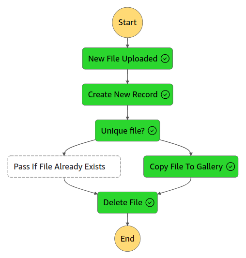

# About
 
This project demonstrates usage of AWS Step Functions and deployment with CDK.

*Use case*: Imagine you have an app where users could upload their files to S3 bucket. It triggers chain of step functions, which calculate hash of the file. And add a record to database, then check if file (hash) is unique, lambda function copies unique file to common bucket. After that original file will be removed from user's bucket to save the space and reduce bills. At the same time your app could provide API that hide that you share same files between customers.



## How to Use

Firstly, some of Lambda functions require additional library (`PyMySQL`) to interact with RDS (MySQL). For that you need to upload Layer to AWS. You could use this script:

```
./make_lambda_layer.sh
```

`Note`: Occasionally, if for some reason you uploaded layer more than once, you most likely need to add layer version from output to `LAYER_ARN` in `infra/dbstack.py` to follow next pattern: `arn:aws:lambda:<your_region:<your_account_id>:layer:<layer_name>:<layer_version>`.

Now you could deploy stacks to AWS.

```
cdk deploy --all -require-approval never
```

If you want to override some database settings e.g. user, db name, you could use `--parameters`:

```
cdk deploy DatabaseStack --parameters DB_USER=myadmin --parameters DB_NAME=superapp
```

After successful deployment you could trigger the flow by uploading file to `UploadBucket` on S3 (see bucket name in outputs).

```
echo "hello world" | aws s3 cp - s3://<upload-bucket-name>
```

Also you could check Step Function execution, if you upload same file twice it should reuse `file_id` from database.

